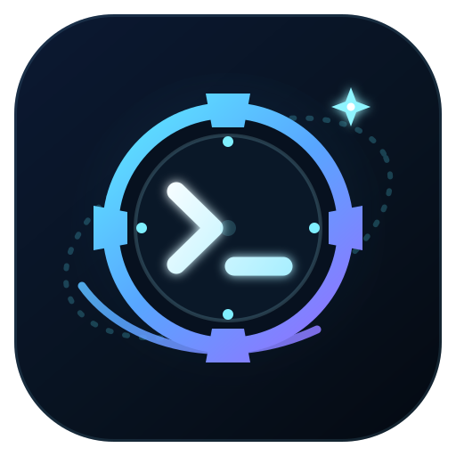

<div align="center">

[English](./README.md) | **한국어**



# SpaceDock

**ChatGPT에서 원격 서버 및 로컬 PC의 개발 환경을 안전하고 정밀하게 제어하는 Self-hosted MCP 개발 런타임**

</div>

---

SpaceDock은 ChatGPT 등 대형 언어 모델(LLM)이 개발 서버나 로컬 컴퓨터의 코드를 직접 탐색하고, 수정하고, 명령을 실행할 수 있도록 연결해 주는 **MCP(Model Context Protocol) 런타임**입니다.

단순히 쉘 명령 하나에 의존하는 불안정한 방식 대신, **체계화된 도구(파일·Git·명령 세션)**와 **엄격한 보안 경계(Allowed Root / Workspace)**를 제공합니다. 또한 메인 작업 트리를 오염시키지 않는 **Git worktree 기반 격리 작업**과 **Codex CLI, GitHub Copilot(ACP) 등 다양한 서브에이전트 연동**을 기본으로 지원합니다.

> [!TIP]
> **왜 SpaceDock인가요?**
> - **체계적인 도구 체계**: 단순 쉘 실행에 그치지 않고 안전한 파일 읽기/쓰기/검색, 인터랙티브 터미널 세션, Git 전용 도구를 제공합니다.
> - **엄격한 디렉터리 격리**: 허가된 디렉터리(Allowed Root) 외의 상위 디렉터리 탈출(`..`, 심볼릭 링크) 및 민감 파일(`.env`, `.ssh`, 인증서 등) 접근을 시스템 차원에서 원천 차단합니다.
> - **Git Worktree 격리 개발**: 에이전트가 코드를 수정할 때 메인 브랜치를 직접 건드리지 않고, 별도의 격리된 Git worktree에서 안전하게 실험하고 검증할 수 있습니다.
> - **멀티 서브에이전트 지원**: OpenAI Codex CLI(`app-server`), GitHub Copilot(`ACP`), Antigravity(`ACP`)를 필요에 따라 유연하게 작업자(Worker)로 호출하여 백그라운드 작업을 위임합니다.
> - **원격 & 로컬 완벽 지원**: 원격 서버에서는 systemd 상시 구동과 OAuth 보안 인증을, 로컬 환경에서는 OpenAI Secure MCP Tunnel 또는 stdio 파이프 연결을 지원합니다.

---

## 목차

- [설치 방법](#설치-방법)
- [연결 방식 비교](#연결-방식-비교)
- [빠른 시작 가이드](#빠른-시작-가이드)
  - [1. 로컬 환경에서 사용하기 (로컬 MCP 클라이언트 / ChatGPT Tunnel)](#1-로컬-환경에서-사용하기)
  - [2. 원격 서버에서 사용하기 (ChatGPT + OAuth + systemd)](#2-원격-서버에서-사용하기)
- [핵심 개념 이해하기](#핵심-개념-이해하기)
  - [Allowed Root와 Workspace (접근 경계)](#1-allowed-root와-workspace)
  - [Checkout 모드 vs Worktree 모드 (작업 격리)](#2-checkout-모드-vs-worktree-모드)
  - [보안 모델과 민감 파일 보호](#3-보안-모델과-민감-파일-보호)
- [서브에이전트(Subagent) 연동](#서브에이전트subagent-연동)
  - [Codex CLI 프로바이더](#codex-cli-프로바이더)
  - [GitHub Copilot (ACP) 프로바이더](#github-copilot-acp-프로바이더)
  - [Antigravity (ACP) 프로바이더](#antigravity-acp-프로바이더)
  - [고수준 통합 Agent 도구](#고수준-통합-agent-도구)
  - [저수준 ACP 직접 제어 도구](#저수준-acp-직접-제어-도구)
- [제공되는 MCP 도구 목록](#제공되는-mcp-도구-목록)
- [원격 서버 systemd 서비스 관리](#원격-서버-systemd-서비스-관리)
- [소스 코드에서 빌드 및 테스트](#소스-코드에서-빌드-및-테스트)
- [참조한 프로젝트](#참조한-프로젝트)

---

## 설치 방법

일반 사용자는 Go 언어를 별도로 설치할 필요가 없습니다. **Node.js 18 이상**과 **npm**만 있으면 사전 빌드된 바이너리가 자동으로 설치됩니다.

```sh
# SpaceDock 전역 설치
npm install -g @starlove7/spacedock

# 설치 확인
spacedock version
```

- **지원 플랫폼**: Linux, macOS, Windows
- **지원 아키텍처**: x64(amd64), arm64

---

## 연결 방식 비교

SpaceDock은 사용 목적에 따라 세 가지 실행 모드를 제공합니다.

| 모드 | 실행 명령어 / 전송 계층 | OAuth 인증 | 주요 용도 |
| :--- | :--- | :--- | :--- |
| **로컬 stdio** | `spacedock serve --stdio` | 미사용 (인증 생략) | Claude Desktop, Cursor 등 로컬 MCP 클라이언트 직접 연동 / OpenAI Secure MCP Tunnel을 통한 ChatGPT 연동 |
| **로컬 loopback HTTP** | `spacedock serve` (`/mcp`) | 적용됨 | OAuth를 지원하는 로컬 HTTP 기반 MCP 클라이언트 테스트 |
| **원격 HTTPS** | 역방향 프록시/터널 → SpaceDock 루프백 | 적용됨 | ChatGPT 공식 커넥터 연동, OCI/AWS 등 클라우드 원격 서버 상시 운영 (systemd 서비스 권장) |

---

## 빠른 시작 가이드

### 1. 로컬 환경에서 사용하기

내 PC에서 SpaceDock을 실행하여 로컬 MCP 클라이언트나 ChatGPT에 연결하는 방법입니다.

#### 1단계: 로컬 설정 초기화
```sh
# 개발 소스 디렉터리를 지정하여 초기화
spacedock init --root /home/you/src --root-id src --root-name "Local source"
```

위 명령을 실행하면 `~/.spacedock/config.yaml`과 소유자 인증 토큰 파일(`~/.spacedock/oauth-owner.token`)이 자동 생성됩니다.

> [!NOTE]
> `config.yaml`의 기본 권한(`permissions`)은 파일 및 작업 공간 관리용(`fs.read`, `fs.write`, `workspace.manage`)으로 설정됩니다.  
> - 터미널 명령 실행이 필요하면 `command.execute`를 추가하세요.  
> - Codex/Copilot 등 서브에이전트 실행이 필요하면 `agent.execute`를 추가하세요.

초기화 후에는 YAML을 직접 편집하지 않고 Allowed Root를 관리할 수 있습니다.

```sh
spacedock root add --path /home/you/other-project --id other --name "Other project"
spacedock root list
spacedock root remove other
```

각 명령은 `--config <path>`를 지원하며 생략하면 `~/.spacedock/config.yaml`을 사용합니다. ID나 이름을 생략한 `root add`는 경로에서 각각 slug와 basename을 정합니다. `root add`의 기본 권한 9개(`fs.read`, `fs.write`, `command.execute`, `git.read`, `workspace.manage`, `recall.read`, `recall.write`, `acp.connect`, `agent.execute`)는 `spacedock init`과 동일합니다. 변경 내용은 다음 `serve` 프로세스 시작 또는 service restart부터 읽히며, 실행 중인 서버에는 hot reload가 적용되지 않습니다.

#### 2단계: 연결하기

- **로컬 MCP 클라이언트(Claude Desktop, Cursor 등)에 연동 시**
  클라이언트 설정 파일(JSON)에 다음 stdio 커맨드를 등록합니다.
  ```json
  {
    "mcpServers": {
      "spacedock": {
        "command": "spacedock",
        "args": ["serve", "--stdio"]
      }
    }
  }
  ```
  *(설정 파일 경로를 직접 지정하려면 `args`에 `["serve", "--stdio", "--config", "/절대경로/config.yaml"]`을 전달합니다.)*

- **ChatGPT에서 로컬 SpaceDock에 연결 시 (OpenAI Secure MCP Tunnel 사용)**
  ChatGPT 웹 서비스는 사용자의 로컬 PC stdio 파이프에 직접 접속할 수 없으므로, 공인 IP나 외부 포트 개방 없이 안전하게 연결해 주는 [OpenAI Secure MCP Tunnel](https://github.com/openai/tunnel-client)을 사용합니다.

  1. [OpenAI Platform Tunnels](https://platform.openai.com/settings/organization/tunnels) 페이지에서 새 터널을 생성합니다 (ChatGPT에서 사용할 작업 공간과 연결되어 있어야 함).
  2. `tunnel-client`를 설치하고, **Tunnels Read + Use** 권한을 가진 Runtime API Key를 발급받습니다.
  3. 로컬 터널 프로필을 생성하고 실행합니다:
     ```sh
     # 런타임 API 키 설정 (보안상 명령 인자에 넣지 않고 환경 변수로 지정)
     export CONTROL_PLANE_API_KEY="sk-..."

     # 프로필 초기화 (복사한 Tunnel ID 지정)
     tunnel-client init \
       --sample sample_mcp_stdio_local \
       --profile spacedock-local \
       --tunnel-id tunnel_0123456789abcdef0123456789abcdef \
       --mcp-command "spacedock serve --stdio"

     # 진단 및 터널 실행
     tunnel-client doctor --profile spacedock-local --explain
     tunnel-client run --profile spacedock-local
     ```
     > [!WARNING]
     > 이때 터미널에서 별도로 `spacedock serve --stdio`를 미리 실행하지 마세요! `tunnel-client`가 SpaceDock 프로세스를 직접 자식 프로세스로 실행하고 stdio 통신을 관리합니다.

  4. `tunnel-client run`이 실행 중인 상태에서 [ChatGPT 커넥터 설정](https://chatgpt.com/#settings/Connectors)으로 이동해 **Connection: Tunnel**을 선택하고, 등록한 터널을 지정하면 연결이 완료됩니다.

---

### 2. 원격 서버에서 사용하기

OCI(오라클 클라우드), AWS, GCP 등의 원격 리눅스 서버에 SpaceDock을 상시 구동하고, ChatGPT에서 도메인 URL로 접속하는 방법입니다.

```text
[ChatGPT]
   │ HTTPS 요청 (OAuth 인증)
   ▼
[역방향 프록시 / 터널] (Cloudflare Tunnel, Nginx 등)
   │ 127.0.0.1:8766 로 로컬 전달
   ▼
[SpaceDock 런타임] (systemd user service로 상시 구동)
   │
   ▼
[허용된 프로젝트 디렉터리] (Allowed Roots)
```

#### 1단계: 원격 서버 초기화
서버에서 관리할 프로젝트 디렉터리와 외부 접근 도메인을 지정하여 초기화합니다.

```sh
spacedock init \
  --root /home/ubuntu/github \
  --root-id github \
  --root-name "GitHub Projects" \
  --public-base-url https://spacedock.example.com
```

- 설정 파일: `~/.spacedock/config.yaml`
- 소유자 승인 토큰: `~/.spacedock/oauth-owner.token` (보안을 위해 초기화 출력에 노출되지 않음)

#### 2단계: 역방향 프록시(Reverse Proxy) 또는 터널 구성
SpaceDock 내부 HTTP 서버는 보안을 위해 **로컬 루프백(`127.0.0.1:8766`)에서만 요청을 수신**합니다.  
따라서 Cloudflare Tunnel, Nginx, Caddy 등을 이용해 외부 HTTPS 도메인(`https://spacedock.example.com`)의 요청을 `http://127.0.0.1:8766`으로 전달하도록 설정해야 합니다.

> [!NOTE]
> Nginx 등 신뢰할 수 있는 역방향 프록시가 `X-Forwarded-For` 헤더를 올바르게 전달하는 환경이라면, `config.yaml`의 `server.trust_proxy: true` 설정을 활성화하여 클라이언트 IP 기반 레이트 리미팅이 정상 작동하도록 구성하세요.

#### 3단계: systemd 서비스 등록 및 실행
백그라운드 상시 구동을 위해 systemd 사용자 서비스를 등록합니다.

```sh
# 서비스 설치 및 즉시 시작
spacedock service install

# 실행 상태 확인
spacedock service status
```

> [!TIP]
> SSH 세션을 종료(로그아웃)한 뒤에도 서비스가 계속 실행되도록 하려면 아래 명령을 한 번 실행해 주세요:
> ```sh
> loginctl enable-linger $USER
> ```

#### 4단계: ChatGPT 커넥터에 등록 및 OAuth 승인
1. [ChatGPT 커넥터 설정](https://chatgpt.com/#settings/Connectors)에서 새 MCP 커넥터를 추가하고 URL을 입력합니다:
   ```text
   https://spacedock.example.com/mcp
   ```
2. 등록 시 브라우저에 **소유자 승인(Owner Approval) 화면**이 표시됩니다.
3. 서버의 `~/.spacedock/oauth-owner.token` 파일 내용을 열어 복사한 뒤, 브라우저 승인 페이지에 입력하면 OAuth 연동이 완료됩니다.
   > **소유자 토큰(Owner Token)이란?**  
   > 아무나 내 서버의 MCP에 접속하지 못하도록, 서버 소유자 본인이 연결 요청을 최종 승인하기 위해 사용하는 **마스터 비밀값**입니다.

---

## 핵심 개념 이해하기

### 1. Allowed Root와 Workspace

SpaceDock은 시스템 전체에 무제한 접근을 허용하지 않고 계층화된 보안 접근 경계를 적용합니다.

```text
[Allowed Root] (허가된 최상위 디렉터리: 예: /home/ubuntu/github)
   │
   ├── [Workspace A] (프로젝트 1: spacedock)
   └── [Workspace B] (프로젝트 2: another-app)
```

- **Allowed Root (허용 디렉터리 경계)**:  
  ChatGPT가 접근할 수 있는 최상위 디렉터리 화이트리스트입니다. `config.yaml`에 정의되며 디렉터리별로 권한(`permissions`)을 차등 부여할 수 있습니다.
- **Workspace (작업 공간)**:  
  Allowed Root 내부의 특정 프로젝트 폴더를 연 단위입니다.
- **철저한 경로 검증**:  
  모든 파일 및 Git 작업은 먼저 `workspace_open`으로 Workspace를 연 뒤 수행됩니다. `..`를 통한 상위 디렉터리 탈출, 절대 경로 직접 지정, 심볼릭 링크를 통한 허용 경계 밖 탐색은 모두 차단됩니다.

```text
# ChatGPT의 일반적인 작업 흐름
1. workspace_list                           → 허용된 루트 목록 조회
2. workspace_open(root_id, path, mode)      → 특정 프로젝트 열기 (workspace_id 발급)
3. read_file / file_edit / exec_command     → 해당 workspace_id 내에서만 안전하게 실행
```

---

### 2. Checkout 모드 vs Worktree 모드

Workspace를 열 때는 작업 방식(`mode`)을 선택할 수 있습니다.

```text
workspace_open(root_id="github", path="spacedock", mode="checkout")
# 또는
workspace_open(root_id="github", path="spacedock", mode="worktree", base_ref="HEAD")
```

| 모드 | 동작 방식 | 적합한 작업 | 안전성 특징 |
| :--- | :--- | :--- | :--- |
| **`checkout`** | 기존 디렉터리의 작업 트리를 그대로 사용 | 단순 코드 확인, 가벼운 수정, 빠른 디버깅 | 수정 내용이 기존 워킹 디렉터리에 즉시 반영되므로 주의 필요 |
| **`worktree`** | `~/.spacedock/worktrees/<ws-id>`에 Git worktree를 독립 생성 (detached HEAD) | 에이전트의 대규모 코드 리팩터링, 기능 구현, 실험적 패치 작성 | 메인 작업 트리를 전혀 건드리지 않고 격리된 상태에서 안전하게 작업 진행 |

> [!IMPORTANT]
> **더러워진(Dirty) Worktree 보호 메커니즘**  
> `worktree` 모드에서 작업 중 커밋되지 않은 수정 사항이 남아있는 경우, 일반적인 `workspace_close` 호출 시 실수를 방지하기 위해 `WORKTREE_DIRTY` 에러를 반환하며 닫히지 않습니다. 변경 사항을 완전히 포기하고 정리하려면 의도적으로 `workspace_discard(force=true)`를 호출해야 합니다.

Workspace 정보는 디스크(`workspaces.json`)에 영구 저장되므로, SpaceDock이나 systemd가 재시작되어도 열려 있던 Workspace 목록과 Worktree 정보가 유지됩니다. *(단, 실행 중이던 에이전트 프로세스는 복구되지 않습니다.)*

---

### 3. 보안 모델과 민감 파일 보호

SpaceDock의 보안 계층을 올바르게 이해하는 것이 안전한 서버 운영의 핵심입니다.

#### ① 파일 도구의 민감 경로 자동 차단 (Deny Layer)
구조화된 파일 도구(`read_file`, `list_dir`, `file_edit` 등)는 Allowed Root 내에 있더라도 다음과 같은 민감한 파일/경로에 대한 접근을 **원천 차단(`PERMISSION_DENIED`)**합니다:
- **환경 변수 및 설정**: `.env`, `.env.*`
- **인증 및 키 파일**: `.ssh`, `.aws`, `.gnupg`, `known_hosts`, 각종 credentials 파일
- **보안 인증서 및 개인키**: `.pem`, `.key`, `.pfx`, `.p12` 확장자 파일
- 디렉터리 목록 조회(`list_dir`)나 텍스트 검색(`search_text`) 시에도 민감 항목은 결과에서 완전히 숨겨지며 개수 카운트에도 포함되지 않습니다.
- 필요 시 `security.sensitive_paths.additional_patterns`에 패턴을 추가할 수 있으며, 내장 차단 목록은 비활성화할 수 없습니다.

#### ② 쉘 명령 실행(`exec_command`)의 보안 경계
> [!WARNING]
> **`command.execute`는 OS 샌드박스가 아닙니다!**  
> `exec_command`를 통해 실행되는 터미널 명령은 SpaceDock을 구동 중인 **로컬 OS 사용자 계정의 실제 권한**으로 실행됩니다.  
> 위의 민감 경로 차단 계층은 SpaceDock의 파일 전용 도구에만 적용되며, 임의의 쉘 명령(예: `cat ~/.ssh/id_rsa`)까지 강제로 차단하지는 못합니다.

#### 운영 보안 수칙 체크리스트
- [ ] 신뢰할 수 있는 개발 디렉터리만 `Allowed Root`로 등록하세요.
- [ ] 단순 코드 읽기/리뷰 전용 프로젝트에는 `command.execute` 및 `fs.write` 권한을 부여하지 마세요.
- [ ] SpaceDock HTTP 리스너는 외부로 직접 노출하지 말고 루프백(`127.0.0.1`)으로 유지하세요.
- [ ] `oauth-owner.token` 파일과 `~/.spacedock` 디렉터리가 외부에 노출되지 않도록 주의하세요.

---

## 서브에이전트(Subagent) 연동

SpaceDock은 모든 작업을 하나의 프로토콜로 강제하지 않고, 각 에이전트의 특성에 맞는 최적의 방식으로 직접 구동합니다.

```text
[ChatGPT (메인 컨트롤러)]
         │
         ├── agent_run(profile="codex1")   ──► OpenAI Codex CLI (app-server 구동)
         │
         └── agent_run(profile="copilot1") ──► GitHub Copilot (ACP 프로토콜 구동)
```

### Agent 프로필

주요 에이전트 프로필은 YAML frontmatter와 Markdown 본문으로 이루어진 Markdown 파일입니다. 필수 frontmatter는 `schema: spacedock-agent/v1`, `id`, `provider`이며, 선택 필드는 `name`, `description`, `endpoint_id`, `permission_policy`, `mode_id`, `config_options`, `model`, `effort`, `write_mode`입니다. 본문이 지시사항이며 `instructions`는 frontmatter 필드가 아닙니다.

전역 프로필은 `<state_dir>/agents/*.md`에서 읽으며 기본 경로는 `~/.spacedock/agents/*.md`입니다. Workspace 로컬 프로필은 `<workspace-root>/.spacedock/agents/*.md`에 둡니다. 전역 Markdown 프로필이 같은 ID의 legacy YAML 프로필을 대체합니다. 로컬 Markdown은 프로필을 추가할 수 있지만 전역 Markdown 또는 legacy 설정에 있는 machine-owner ID를 가릴 수 없으며, 충돌은 거부됩니다. agents 디렉터리가 없어도 허용되며, `spacedock init`은 전역 agents 디렉터리만 만들고 기본 프로필 파일은 만들지 않습니다.

`agent_list`와 `agent_run`마다 프로필을 다시 읽으므로 Markdown 편집에는 SpaceDock 재시작이 필요하지 않습니다. `config.yaml`의 `agents.max_concurrent`, `agents.codex.command`, `acp.endpoints` 같은 runtime/provider 설정 변경은 기존과 같이 프로세스 또는 service 재시작이 필요합니다. `config.yaml`의 legacy `agents.profiles`는 호환성 fallback으로만 지원하며 권장 설정이 아닙니다. 예시는 `examples/agents/`를 참고하세요.

### Codex CLI 프로바이더

별도의 어댑터 레이어(`codex-acp` 등)를 거치지 않고, 시스템에 설치된 **Codex CLI의 `app-server` 모드를 SpaceDock이 직접 실행**합니다.

#### runtime 설정 예시 (`config.yaml`)
```yaml
agents:
  max_concurrent: 4 # 동시에 실행될 수 있는 최대 에이전트 턴 수
  codex:
    # PATH에 등록된 명령 또는 실행 파일 절대 경로
    command: codex
```

`~/.spacedock/agents/codex1.md`에 `provider: codex` 프로필을 만들고 `model`, `effort`, `write_mode`를 지정합니다. `write_mode`는 `read_only|allowed|full_access`이며 기본값은 `read_only`입니다. 지시사항은 Markdown 본문에 작성하세요. 예시는 [codex-implementer](./examples/agents/codex-implementer.md) 에 있습니다.

#### 동작 특징
1. **대화 맥락 유지**: `agent_run`으로 시작한 뒤 `agent_continue`를 호출하면, 동일한 Codex thread ID(`thread/resume`)를 재사용하므로 이전 작업 맥락이 온전히 유지됩니다.
2. **비대화식 무중단 작업**: `approvalPolicy=never` 옵션으로 실행되어, 백그라운드 작업 도중 사용자 승인 대기로 멈추지 않고 끝까지 작업을 완료합니다.
3. **샌드박스 단계 매핑 (`write_mode`)**:
   - `read_only`: 파일 읽기 전용
   - `allowed`: 작업 공간 내 파일 수정 허용 (네트워크 접근 포함)
   - `full_access`: 전체 시스템 접근 허용 (주의 필요)
4. **systemd 환경 주의점**: systemd 사용자 서비스는 일반 로그인 쉘과 `PATH` 환경 변수가 다를 수 있습니다. nvm 등으로 Codex를 설치했다면 `/home/ubuntu/.nvm/versions/node/v.../bin/codex`처럼 **절대 경로를 지정**하는 것이 안전합니다.

---

### GitHub Copilot (ACP) 프로바이더

GitHub Copilot은 Agent Client Protocol(ACP)을 통해 연동합니다.

#### runtime 설정 예시 (`config.yaml`)
```yaml
acp:
  endpoints:
    - id: copilot
      name: GitHub Copilot ACP
      # 반드시 실행 파일의 절대 경로를 지정해야 합니다.
      command: /home/ubuntu/.nvm/versions/node/v22.23.2/bin/copilot
      args: [--acp]
      env_from: {}
```

`~/.spacedock/agents/copilot1.md`에 `provider: acp`와 필수 `endpoint_id`를 포함한 프로필을 만듭니다. `permission_policy`는 `manual|allow_once`이며 기본값은 `manual`이고, `mode_id`와 `config_options`를 선택할 수 있습니다. `model`, `effort`, `write_mode`는 Codex 전용 필드이므로 ACP 프로필에서는 사용할 수 없습니다. 예시는 [copilot-worker](./examples/agents/copilot-worker.md) 에 있습니다.

#### 동작 특징
- 일반 ACP endpoint의 `acp.endpoints[*].command`는 환경 변수 혼선을 방지하기 위해 **반드시 실행 파일의 절대 경로**여야 합니다 (`which copilot`으로 확인).
- `permission_policy`는 `manual`(권한 요청 시 수동 승인) 또는 `allow_once`(1회 허용)를 지원합니다.
- `model`, `effort`, `write_mode` 설정은 Codex 전용 필드이며 ACP 프로필에는 적용되지 않습니다.

---

### Antigravity (ACP) 프로바이더

Antigravity는 Agent Control Protocol (ACP)을 통해 SpaceDock과 연동됩니다. `builtin: antigravity` 프리셋을 제공하므로, 수동으로 실행 파일의 절대 경로를 찾을 필요 없이 자동으로 환경을 감지하여 간편하게 연결할 수 있습니다.

#### runtime 설정 예시 (`config.yaml`)

대부분의 환경에서는 `builtin: antigravity`만 지정하면 즉시 사용 가능합니다:

```yaml
acp:
  endpoints:
    - id: antigravity
      name: Antigravity ACP
      builtin: antigravity
      env_from: {}
```

> **참고**: 특정 경로의 실행 파일을 직접 지정하고 싶다면 일반 ACP 엔드포인트처럼 `command: /path/to/agy_acp_server`를 명시할 수도 있습니다.

#### 에이전트 프로필 설정 예시 (`~/.spacedock/agents/antigravity-worker.md`)

`provider: acp`와 `endpoint_id: antigravity`를 지정하여 프로필을 생성합니다. (전체 예시는 [antigravity-worker](./examples/agents/antigravity-worker.md) 참고)

```markdown
---
schema: spacedock-agent/v1
id: antigravity-worker
name: Antigravity Worker
description: Executes tasks using Antigravity via ACP.
provider: acp
endpoint_id: antigravity
permission_policy: manual
config_options: {}
---

지정된 작업 범위를 정확히 수행하세요. 블로커가 발생하면 임의로 범위를 넓히지 말고 보고하세요.
```

#### 실행 파일 자동 탐색 순서

`builtin: antigravity`를 사용할 경우, SpaceDock은 다음 우선순위로 실행 파일을 찾아 자동으로 절대 경로로 정규화합니다:

1. **명시적 `command` 설정**: `config.yaml`에 직접 지정한 경로
2. **환경 변수**: `ANTIGRAVITY_COMMAND` → `AGY_ACP_COMMAND` 순서로 탐색
3. **`agy_acp_server` 래퍼 스크립트** (권장): `PATH` 또는 `~/.local/bin`
   - 인증된 설치 환경에 필요한 런타임 라이브러리와 identity 인자를 자동으로 주입해주므로 바이너리 본체보다 우선합니다.
4. **`agy_acp_server.par` 바이너리 본체**: `PATH` 또는 `~/.local/share/agy_acp_server` (Windows는 `agy_acp_server.exe`)

#### 동작 특징 및 팁

- **자동 절대 경로 정규화**: 일반 ACP 엔드포인트와 달리 `which` 명령 등으로 절대 경로를 일일이 확인하지 않아도 SpaceDock이 자동으로 탐색하고 절대 경로로 정규화하여 실행합니다.
- **인자(`args`) 자동 구성 규칙**: Linux 환경에서 `.par` 본체를 직접 실행할 때 `args` 설정을 생략하면 환경 호환성을 위해 `--uid=` 인자가 자동으로 추가됩니다. 사용자 정의 인자를 지정하거나 기본 플래그를 비활성화하려면 `args: []` 또는 원하는 인자 목록을 입력하세요.
- **표준 라이프사이클 지원**: 등록된 프로필은 다른 ACP 엔드포인트와 동일하게 `initialize` → `session/new` → `session/prompt` 흐름을 따르며, 고수준 도구(`agent_run`, `agent_continue` 등)와 저수준 `acp_*` 도구에서 동일한 방식으로 제어할 수 있습니다.

---

### 고수준 통합 Agent 도구

서브에이전트 프로바이더(Codex, Copilot, Antigravity 등)에 관계없이 일관된 인터페이스로 제어할 수 있습니다.

```text
agent_run       → 지정한 프로필(Codex, Copilot, Antigravity)로 에이전트 세션을 만들고 작업 시작
agent_show      → 에이전트 실행 상태 확인 및 완료 결과 확인 (wait_ms 대기 지원)
agent_continue  → 동일한 컨텍스트(Codex 스레드 / ACP 세션)를 유지하며 추가 작업 지시
agent_stop      → 실행 중인 작업을 취소하고 에이전트 세션 종료
agent_list      → 현재 활성화된 에이전트 목록 조회
```

---

### 저수준 ACP 직접 제어 도구

프로필 기반의 고수준 Agent 도구 외에도, ACP 엔드포인트를 프로토콜 수준에서 세밀하게 제어할 수 있는 저수준 도구를 제공합니다:

- `acp_list`, `acp_connect`, `acp_capabilities`: ACP 엔드포인트 탐색, 연결 및 세션 생성(`session/new`), 기능 조회
- `acp_prompt`, `acp_events`, `acp_cancel`: 프롬프트 전송, 이벤트 링 버퍼 조회, 실행 취소
- `acp_interactions`, `acp_respond`: 권한 요청 등 상호작용 이벤트 확인 및 응답
- `acp_disconnect`: ACP 세션 연결 종료

---

## 제공되는 MCP 도구 목록

SpaceDock은 모든 작업을 쉘 하나로 처리하지 않고, 안전하고 세분화된 도구를 제공합니다:

| 카테고리 | 도구 이름 | 설명 |
| :--- | :--- | :--- |
| **Workspace** | `workspace_list`<br>`workspace_open`<br>`workspace_close`<br>`workspace_discard` | 허용된 루트 조회, 작업 공간 열기(checkout/worktree 모드), 작업 공간 닫기 및 폐기 |
| **Files** | `read_file`<br>`list_dir`<br>`list_files`<br>`search_text`<br>`file_edit` | 안전한 파일 읽기, 디렉터리 목록 조회, 패턴 매칭 파일 검색, 텍스트 정규식 검색, 정밀 파일 수정 |
| **Command** | `exec_command`<br>`session_observe`<br>`session_act` | 터미널 명령 실행, 백그라운드 장기 실행 명령 세션 출력 관찰 및 대화형 입력 송신 |
| **Git** | `git_status`<br>`git_diff`<br>`git_log` | Git 상태 확인, 변경 사항 diff 조회, 커밋 로그 이력 조회 |
| **Recall** | `recall_search`<br>`recall_read`<br>`recall_write`<br>`recall_delete` | 세션 간 유지되는 메모리/키-값 데이터 검색, 조회, 기록 및 삭제 |
| **Subagent** | `agent_list`<br>`agent_run`<br>`agent_show`<br>`agent_continue`<br>`agent_stop` | 프로바이더(Codex / Copilot ACP) 추상화 통합 서브에이전트 실행 및 세션 관리 |
| **Generic ACP**| `acp_list`, `acp_connect`, `acp_prompt` 등 | 저수준 ACP 프로토콜 직접 통신 및 이벤트 제어 |

---

## 원격 서버 systemd 서비스 관리

Linux 서버에서는 `spacedock service` 서브커맨드로 간편하게 systemd 사용자 서비스를 관리할 수 있습니다.

```sh
# 서비스 설치 및 자동 실행 등록
spacedock service install

# 서비스 상태 확인
spacedock service status

# 서비스 시작 / 중지 / 재시작
spacedock service start
spacedock service stop
spacedock service restart

# 서비스 제거
spacedock service uninstall
```

- 서비스 정의 파일 위치: `~/.config/systemd/user/spacedock.service`
- 현재 SpaceDock 실행 파일 바이너리와 활성 설정 파일의 절대 경로를 참조하여 등록됩니다.

---

## 소스 코드에서 빌드 및 테스트

소스를 직접 수정하거나 기여하려는 개발자는 Go 및 Node.js 환경에서 아래 명령을 사용할 수 있습니다:

```sh
# 전체 테스트 실행
go test ./...

# 레이스 컨디션 검사 포함 테스트
go test -race ./...

# 코드 정적 분석
go vet ./...

# Go 바이너리 빌드
go build ./cmd/spacedock

# 크로스 플랫폼 npm 바이너리 패키징
npm run build:npm-binaries
```

- **Go 모듈 경로**: `github.com/starlove7/spacedock`

---

## 참조한 프로젝트

SpaceDock은 다음 오픈소스 프로젝트들로부터 많은 영감과 설계를 참고하여 개발되었습니다:

1. **[DevSpace](https://github.com/Waishnav/devspace)**: Allowed Root 및 Workspace 기반의 개발 환경 격리 경계 모델과 구조화된 개발 도구 체계 설계에 영감을 받았습니다.
2. **[AgentDock](https://github.com/uvwt/agentdock)**: 에이전트 런타임 제어 및 다중 서브에이전트 세션 관리 구조 설계에 참조되었습니다.
